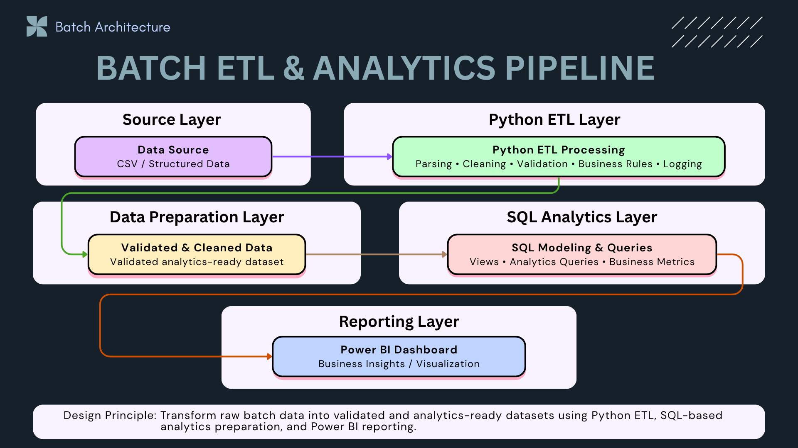
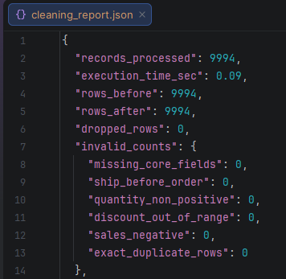
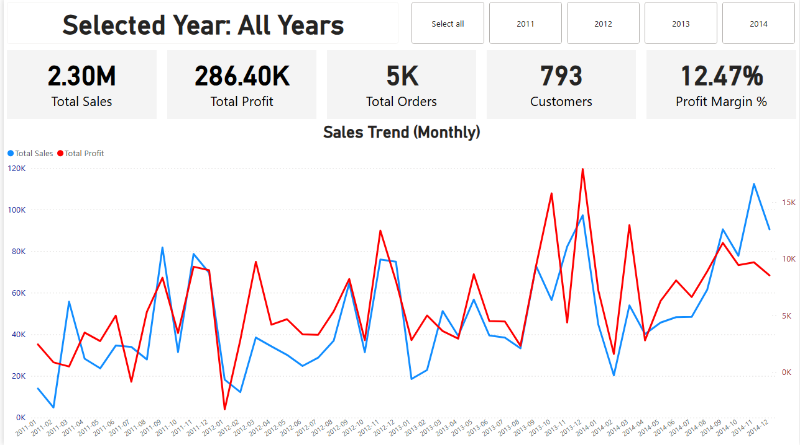
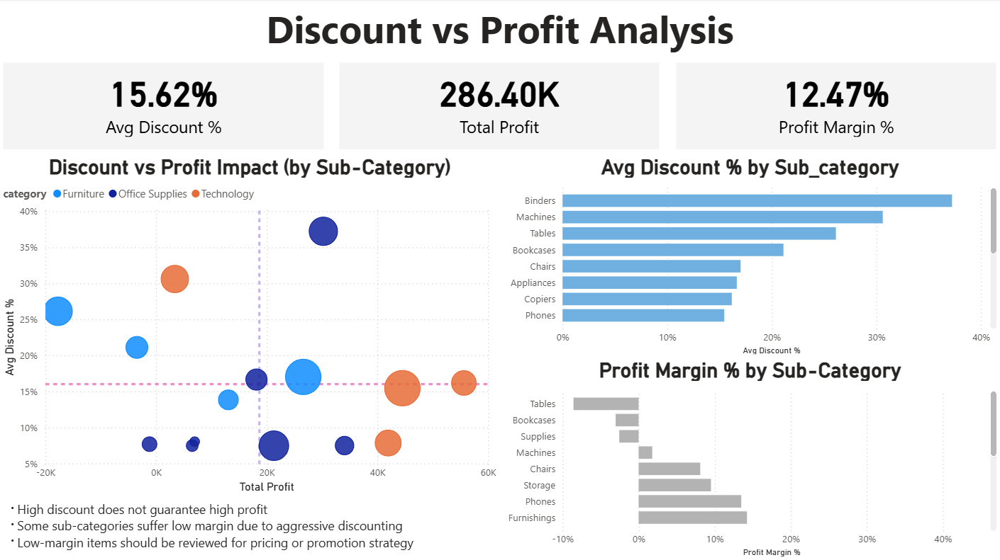

# 📊 Superstore ETL & Analytics Pipeline — Production-Style Batch Processing

> 🧩 Foundation Layer of a Data Platform  
> Transform raw data into analytics-ready datasets using validation, modeling, and structured processing


---

## 📌 Summary

This project implements a production-grade batch ETL pipeline that transforms raw transactional data into analytics-ready datasets.

The pipeline follows a real-world data flow:

👉 Extract → Validate → Transform → Aggregate → Serve (BI)

Key characteristics:

- Reliable processing with structured validation rules  
- Reproducible pipeline with deterministic transformations  
- Analytics-ready outputs for downstream consumption (SQL + Power BI)  

👉 This is not a simulation — it is a complete batch pipeline from raw data to business insights

---

## 🔥 System Impact

- 🧹 Ensure data quality before downstream processing
- 📊 Enable accurate business insights through clean datasets
- 🧩 Provide structured data model for analytics and BI
- 🔁 Create reproducible and reliable data transformation pipeline

👉 This simulates the foundation layer of a real-world data platform

---

### 🚀 What this project demonstrates

* ⚡ Data validation and anomaly detection
* 🧩 Structured transformation using Pandas
* 🏢 Dimensional modeling (Star Schema)
* 📊 SQL-based analytical layer
* 📈 BI-ready datasets for Power BI

---

### 💡 Why this matters

Raw data is not directly usable in analytics.

👉 It must be cleaned, validated, transformed, and modeled
👉 before it becomes **business-ready data**

---

## 🧭 Architecture Overview

This project demonstrates a **batch ETL and analytics pipeline** that transforms raw structured data into validated, analytics-ready datasets for business reporting.

The pipeline uses **Python** for parsing, cleaning, validation, business rules, and logging, **SQL** for analytics preparation, and **Power BI** for dashboard reporting.



**Design principle:** Transform raw batch data into validated, analytics-ready datasets using Python for ETL processing, SQL for analytics preparation, and Power BI for reporting.

### Key Components

- **Data Source:** CSV and structured batch data
- **Python ETL Processing:** Parsing, cleaning, validation, business rules, and logging
- **Prepared Data Layer:** Validated, cleaned, and standardized structured data
- **SQL Analytics Layer:** Builds views, queries, and business metrics
- **Power BI Dashboard:** Delivers business insights and visual reporting

👉 **This pipeline ensures clean separation between ingestion, processing, analytics preparation, and reporting layers.**

---

## 📊 Production Features

- 🧹 Data validation layer (null checks, schema validation)
- 🧠 Business rule enforcement (e.g., non-negative sales)
- 🧩 Dimensional modeling (Star Schema)
- 📊 SQL analytical views for BI
- 📈 Structured logging for observability

👉 Designed to simulate production-grade batch data processing

---

## 🔄 Data Flow (Batch Processing)

### 1️⃣ Ingestion (Raw Layer)

* Load raw CSV dataset
* Inspect schema and structure

---

### 2️⃣ Validation (Data Quality Layer)

* Null value checks
* Data type validation
* Business rule validation (e.g., non-negative sales)

👉 Prevents bad data from propagating downstream

---

### 3️⃣ Transformation (Processing Layer)

* Data cleaning and normalization
* Feature engineering
* Derived metrics calculation

---

### 4️⃣ Modeling (Warehouse Layer)

* Fact table: sales transactions
* Dimension tables: customer, product, region

👉 Optimized for analytical queries

---

### 5️⃣ Analytics (Serving Layer)

* SQL views for aggregation
* Pre-computed datasets for BI tools

👉 Data becomes **dashboard-ready**

---

## 📊 Execution Proof

### ⚙️ Batch Pipeline Metrics



- Processed **9,994 records/run**
- Execution time: **~0.09 seconds**
- Applied **6 validation rules**
- Output: **0 invalid records after validation**

---

### 📈 Dashboard Overview



👉 High-level business insights from transformed dataset

---

### 📉 Discount vs Profit Analysis



👉 Demonstrates how discount impacts profitability

---

## 📊 Output

Generated after pipeline execution:

* Cleaned dataset: **9,994 records**
* Rejected dataset: **0 invalid records**
* Cleaning report with execution metrics
* Fact & dimension tables
* Analytical SQL views

---

## 🚀 Run Pipeline

```bash
python clean_superstore.py
```

---

## 📊 Observability

* Structured logging for each pipeline step
* Execution traceability
* Reproducible outputs

👉 Enables debugging and monitoring in production environments

---

## ⚡ Scalability Design

* Batch processing ensures deterministic execution
* Layered pipeline design improves maintainability
* Star schema optimizes analytical performance

---

### 💡 Design Insight

This pipeline follows a **layered data architecture**:

👉 Raw → Clean → Model → Analytics

This ensures:

* Data quality ✔
* Reusability ✔
* Performance ✔

---

## 🧠 Engineering Decisions

### Why Batch Processing?
- Suitable for structured historical data
- Ensures deterministic and reproducible results
- Easier to validate and debug

### Why Pandas for Transformation?
- Flexible for data cleaning and feature engineering
- Efficient for medium-scale batch processing
- Easy integration with Python ecosystem

### Why Star Schema?
- Optimized for analytical queries
- Simplifies BI consumption
- Separates facts and dimensions clearly

---

## 🧠 What This Project Demonstrates

* Production-style batch ETL pipeline
* Data quality-first design
* Dimensional modeling for analytics
* SQL-based serving layer
* End-to-end data transformation workflow

---

## 💡 Key Takeaway

Modern data systems do NOT use raw data directly.

👉 They rely on structured pipelines to transform data into **analytics-ready datasets**

---

### 🚀 Serving Flow
Raw → Validation → Transformation → Modeling → SQL → BI

---

## 🔥 Final Thought

This is not just a data cleaning project.

👉 It represents the **foundation layer of a Data Platform**

---

### 🧩 Role in Data Platform

Batch ETL (this project)
→ API Serving Layer (Project 2)
→ Streaming Pipeline (Project 3)
→ Orchestration (Project 4)
→ Cloud Platform (Project 5)

---

👉 **This is how Data Engineers build data systems — starting from clean data foundations.**
