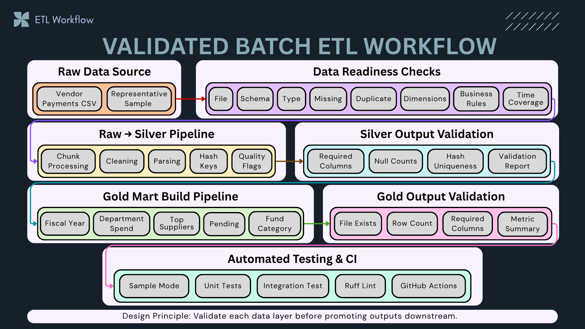
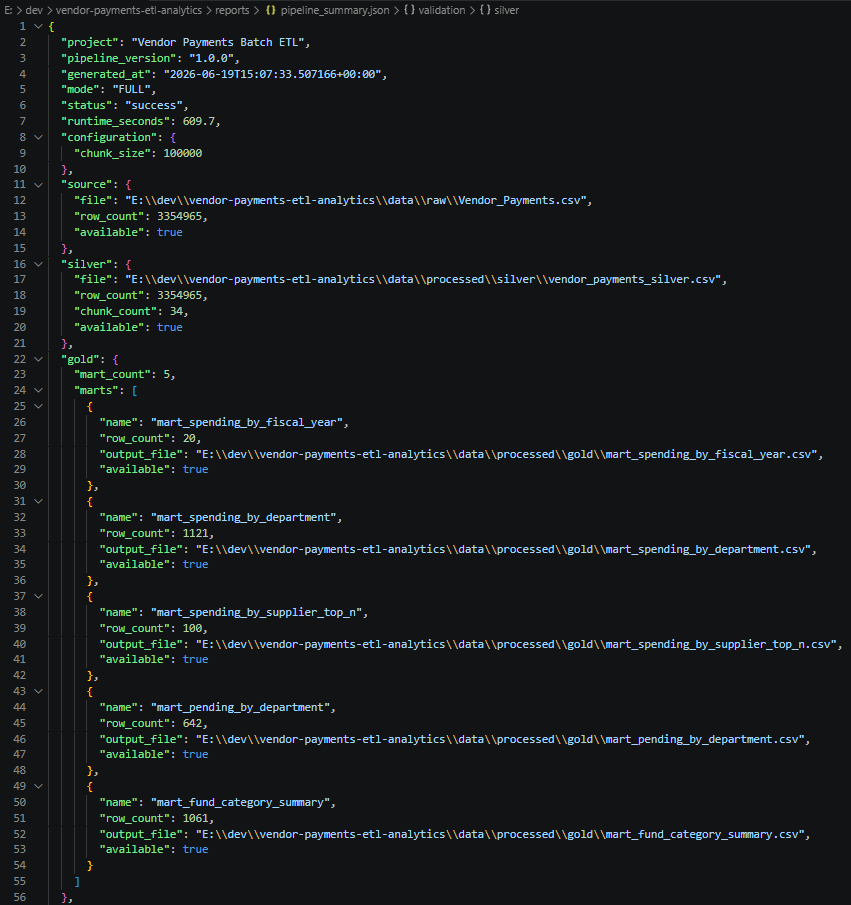
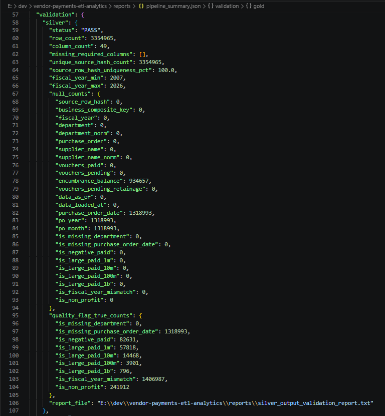
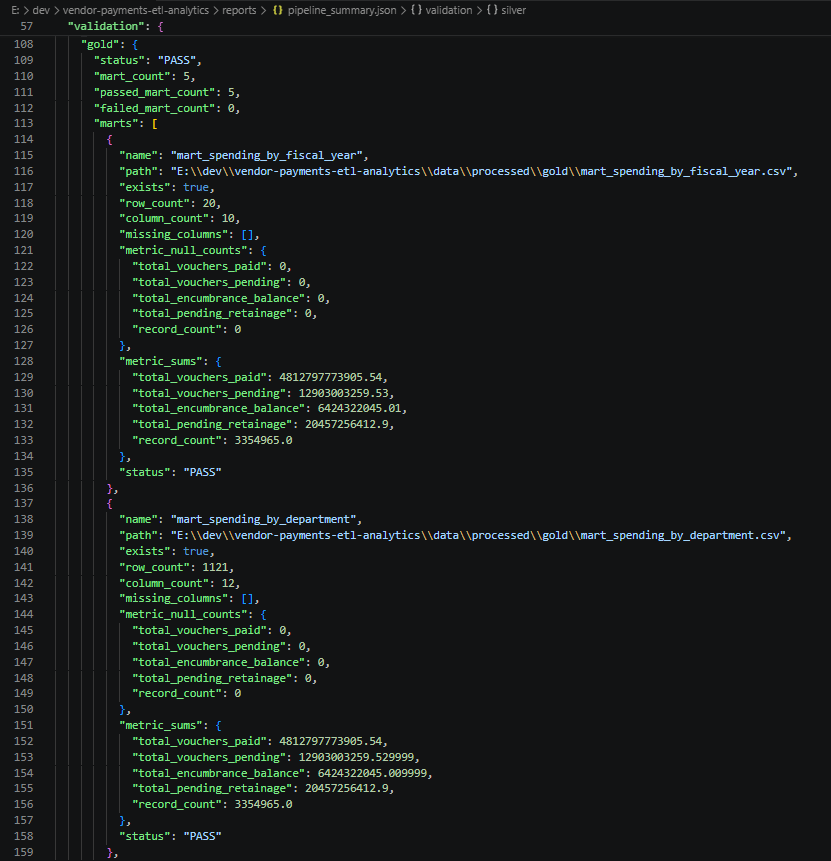
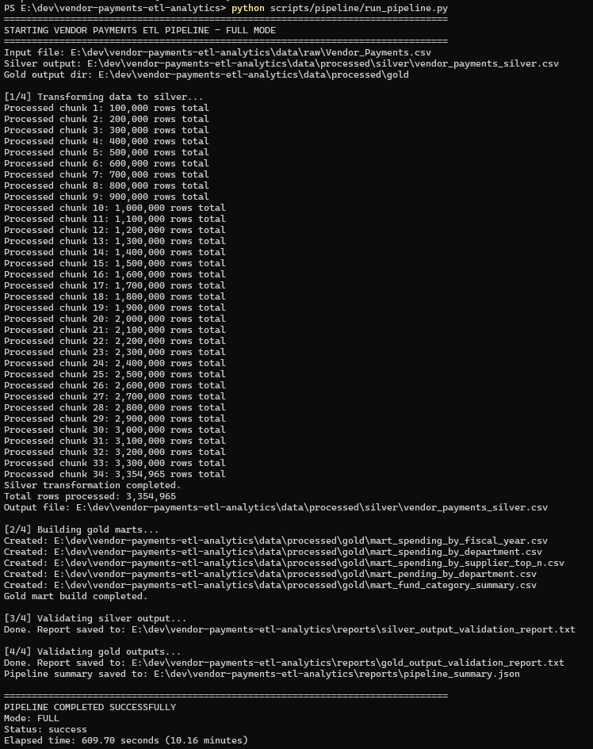
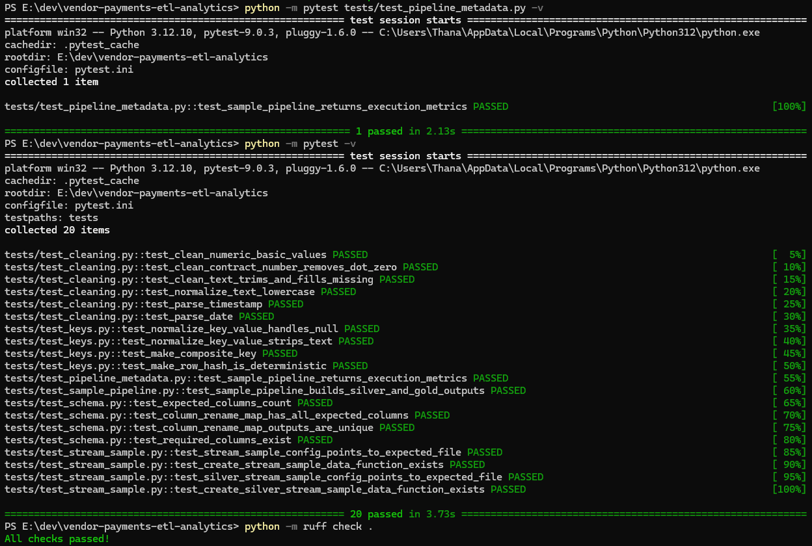
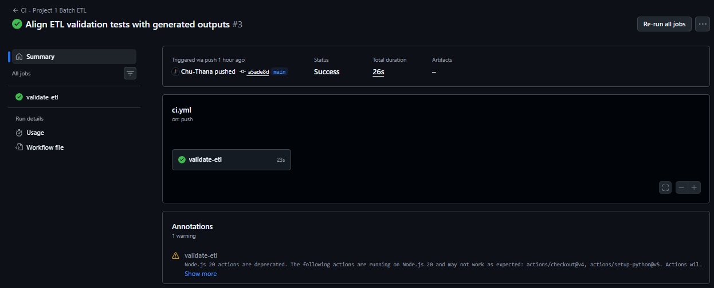

# 📊 Vendor Payments Batch ETL Pipeline


Production-style Batch ETL pipeline for transforming large-scale vendor payment data into validated Silver datasets and analytics-ready Gold marts.

This project is part of the **Vendor Payments Data Engineering Portfolio** and provides the trusted Batch foundation used by downstream orchestration, API serving, cloud publishing, dashboards, and web applications.

---

## 📌 Project Summary

The pipeline processes more than **3.35 million vendor payment records** through a validated Raw → Silver → Gold workflow.

It demonstrates:

* Chunk-based processing for large CSV datasets
* Data readiness profiling before transformation
* Raw → Silver → Gold layered data architecture
* Deterministic row identity and business-level key analysis
* Data cleaning, parsing, normalization, and quality flags
* Analytics-ready Gold mart generation
* Silver and Gold output validation
* Runtime metadata and execution summary generation
* Sample mode for local testing and CI
* Automated testing, Ruff linting, and GitHub Actions CI

---

## 🧭 Architecture



The pipeline follows this workflow:

```text
Raw Data Source
→ Data Readiness Checks
→ Silver Transformation
→ Gold Mart Build
→ Silver Output Validation
→ Gold Output Validation
→ Runtime Metadata
→ Automated Testing and CI
```

### Layer Responsibilities

* **Raw Data Source** — Original Vendor Payments CSV and committed representative sample
* **Data Readiness Checks** — File structure, schema, parsing, missing values, duplicates, business rules, dimensions, and time coverage
* **Silver Transformation** — Chunk processing, cleaning, parsing, normalized dimensions, deterministic keys, and quality flags
* **Gold Mart Build** — Fiscal year, department, supplier, pending payment, and fund category aggregations
* **Silver Validation** — Required columns, row counts, null counts, hash uniqueness, fiscal year coverage, and quality flags
* **Gold Validation** — File availability, row counts, required columns, metric null checks, and metric summaries
* **Runtime Metadata** — Execution status, runtime, row counts, chunk counts, Gold mart outputs, and validation results
* **Automated Quality Assurance** — Pytest, Ruff, sample-mode execution, and GitHub Actions CI

---

## 📊 Project Metrics

The following metrics were generated from the latest successful full pipeline execution.

| Metric                       |          Value |
| ---------------------------- | -------------: |
| Source records processed     |      3,354,965 |
| Silver records produced      |      3,354,965 |
| Processing chunks            |             34 |
| Chunk size                   |   100,000 rows |
| Silver columns validated     |             49 |
| Source row hash uniqueness   |           100% |
| Gold marts produced          |              5 |
| Gold marts passed validation |          5 / 5 |
| Full pipeline runtime        | 609.70 seconds |
| Full pipeline duration       |  10.16 minutes |
| Automated tests passed       |             20 |
| Pipeline status              |        Success |

---

## 🔎 Runtime Metadata

Each pipeline execution generates a machine-readable summary.

Full mode:

```text
reports/pipeline_summary.json
```

Sample mode:

```text
reports/pipeline_summary_sample.json
```

The summary includes:

```json
{
  "project": "Vendor Payments Batch ETL",
  "pipeline_version": "1.0.0",
  "mode": "FULL",
  "status": "success",
  "runtime_seconds": 609.7,
  "configuration": {
    "chunk_size": 100000
  },
  "source": {
    "row_count": 3354965,
    "available": true
  },
  "silver": {
    "row_count": 3354965,
    "chunk_count": 34,
    "available": true
  },
  "gold": {
    "mart_count": 5
  }
}
```

The metadata is generated from the current execution results rather than manually maintained metrics.



---

## 📂 Dataset

The source dataset contains government vendor payment and purchase order records.

The data includes:

* Fiscal year
* Organization group and department
* Program and fund information
* Supplier or payee name
* Purchase order reference
* Voucher paid and pending amounts
* Encumbrance balance
* Contract information
* Source freshness timestamps

The full source dataset is stored locally and excluded from GitHub because of its size.

```text
data/raw/Vendor_Payments.csv
```

A representative sample is committed for testing and CI:

```text
data/sample/vendor_payments_sample.csv
```

---

## 🧪 Data Readiness Checks

The source dataset was profiled before designing the ETL transformations.

| Check               | Purpose                                                              |
| ------------------- | -------------------------------------------------------------------- |
| File Structure      | Validate file size, delimiter, header, row count, and malformed rows |
| Schema              | Confirm expected columns and column order                            |
| Data Types          | Validate numeric, date, timestamp, and identifier parsing            |
| Missing Values      | Separate critical, warning-level, and optional fields                |
| Duplicate Strategy  | Evaluate full-row identity and business-level keys                   |
| Business Rules      | Detect negative payments, large values, and date inconsistencies     |
| Dimension Profiling | Analyze departments, suppliers, programs, and funds                  |
| Time Coverage       | Validate fiscal year range and source freshness timestamps           |

Readiness result:

```text
READY WITH DESIGN WARNINGS
```

The warnings are handled through cleaning, nullable-field rules, deterministic keys, normalized dimensions, and explicit data quality flags.

---

## 🥈 Silver Transformation

The Silver layer standardizes the raw dataset while preserving row-level traceability.

Processing includes:

* Expected schema validation
* Chunk-based CSV processing
* Snake-case column renaming
* Numeric cleaning
* Date and timestamp parsing
* Contract number normalization
* Text trimming and normalization
* Deterministic `source_row_hash`
* Business-level `business_composite_key`
* Fiscal year and purchase-order date comparison
* Data quality flag generation

Silver output:

```text
data/processed/silver/vendor_payments_silver.csv
```

Key quality flags include:

```text
is_missing_department
is_missing_purchase_order_date
is_negative_paid
is_large_paid_1m
is_large_paid_10m
is_large_paid_100m
is_large_paid_1b
is_fiscal_year_mismatch
is_non_profit
```

---

## 🥇 Gold Analytics Marts

The Gold layer creates five analytics-ready datasets.

| Mart                              | Purpose                             |  Rows |
| --------------------------------- | ----------------------------------- | ----: |
| `mart_spending_by_fiscal_year`    | Fiscal year spending trends         |    20 |
| `mart_spending_by_department`     | Department-level spending analytics | 1,121 |
| `mart_spending_by_supplier_top_n` | Top supplier payment analysis       |   100 |
| `mart_pending_by_department`      | Pending voucher monitoring          |   642 |
| `mart_fund_category_summary`      | Fund type and category analytics    | 1,061 |

Gold output directory:

```text
data/processed/gold/
```

Each mart contains aggregated financial metrics, record counts, supplier counts, and selected data quality indicators.

---

## ✅ Validation

The pipeline validates both Silver and Gold outputs before reporting a successful execution.

### Silver Validation

Silver validation checks:

* Output file availability
* Total row count
* Required columns
* Null counts
* Deterministic row hash uniqueness
* Fiscal year range
* Quality flag counts

Latest result:

```text
Status: PASS
Rows validated: 3,354,965
Columns validated: 49
Missing required columns: 0
Source row hash uniqueness: 100%
Fiscal year range: 2007–2026
```



### Gold Validation

Gold validation checks:

* Gold mart file existence
* Non-empty output
* Required columns
* Metric null counts
* Aggregated metric summaries
* Individual mart validation status

Latest result:

```text
Status: PASS
Gold marts validated: 5
Passed marts: 5
Failed marts: 0
```



---

## 🖥️ Execution Evidence

The full pipeline processed all **3,354,965 records** in 34 chunks and generated all five Gold marts.

```text
Mode: FULL
Status: success
Runtime: 609.70 seconds
Duration: 10.16 minutes
```



---

## 🧪 Automated Testing

The project contains unit, integration, sample pipeline, streaming sample configuration, and metadata tests.

Validation covers:

* Schema definitions
* Column rename mappings
* Required source columns
* Numeric cleaning
* Contract number cleaning
* Text normalization
* Timestamp and date parsing
* Deterministic row hashing
* Business composite key generation
* Sample Silver output generation
* Gold mart generation
* Streaming sample configuration
* Structured pipeline execution metrics

Run tests:

```powershell
python -m pytest -v
```

Run code quality checks:

```powershell
python -m ruff check .
```

Current result:

```text
20 tests passed
Ruff passed
```



---

## ⚙️ Continuous Integration

GitHub Actions runs on pushes and pull requests.

The workflow performs:

```text
Repository checkout
→ Python environment setup
→ Dependency installation
→ Ruff linting
→ Sample ETL execution
→ Pytest validation
```

The CI pipeline uses the committed representative sample instead of the full local dataset.

```powershell
python scripts/pipeline/run_pipeline.py --sample
python -m pytest -v
```



---

## 🗂️ Project Structure

```text
vendor-payments-etl-analytics/
│
├── assets/
│   ├── cicd/
│   ├── 00_validated-batch-etl-architecture.png
│   ├── 01_full-batch-etl-execution-evidence.png
│   ├── 02_pipeline-summary-overview.png
│   ├── 03_silver-validation-summary.png
│   ├── 04_gold-validation-summary.png
│   └── 05_tests-and-code-quality-evidence.png
│
├── data/
│   ├── raw/
│   ├── sample/
│   └── processed/
│       ├── silver/
│       ├── gold/
│       └── gold_sample/
│
├── reports/
│   ├── data_readiness_summary.md
│   ├── pipeline_summary.json
│   ├── silver_output_validation_report.txt
│   └── gold_output_validation_report.txt
│
├── scripts/
│   ├── checks/
│   └── pipeline/
│
├── src/
│   ├── cleaning.py
│   ├── config.py
│   ├── keys.py
│   └── schema.py
│
├── tests/
│   ├── test_cleaning.py
│   ├── test_keys.py
│   ├── test_pipeline_metadata.py
│   ├── test_sample_pipeline.py
│   ├── test_schema.py
│   └── test_stream_sample.py
│
├── .github/workflows/ci.yml
├── pyproject.toml
├── pytest.ini
├── requirements.txt
└── README.md
```

---

## ▶️ Run Locally

Create and activate a virtual environment:

```powershell
python -m venv .venv
.\.venv\Scripts\Activate.ps1
```

Install dependencies:

```powershell
python -m pip install --upgrade pip
python -m pip install -r requirements.txt
```

### Run the Full Pipeline

The full source CSV must exist locally.

```powershell
python scripts/pipeline/run_pipeline.py
```

Generated outputs:

```text
data/processed/silver/vendor_payments_silver.csv
data/processed/gold/
reports/pipeline_summary.json
reports/silver_output_validation_report.txt
reports/gold_output_validation_report.txt
```

### Run the Sample Pipeline

```powershell
python scripts/pipeline/run_pipeline.py --sample
```

Generated sample outputs:

```text
data/processed/silver/vendor_payments_silver_sample.csv
data/processed/gold_sample/
reports/pipeline_summary_sample.json
reports/silver_output_validation_report_sample.txt
reports/gold_output_validation_report_sample.txt
```

---

## 🧠 Key Engineering Decisions

### Why use chunk-based processing?

The full source contains more than 3.35 million records.

Processing the CSV in 100,000-row chunks reduces peak memory usage and supports larger local datasets without loading the entire source file at once.

### Why use sample mode?

The full dataset is too large to commit and should not be required by CI.

Sample mode provides a reproducible execution path for local validation and GitHub Actions.

### Why use `source_row_hash`?

The source dataset does not contain a reliable single-column primary key.

`source_row_hash` provides deterministic row-level identity and supports validation of row preservation through the Silver layer.

### Why use a business composite key?

Purchase order values are not unique and include many direct-payment records.

The business composite key supports business-level duplicate analysis without treating purchase order as a primary key.

### Why use Fiscal Year as the reporting period?

Purchase order dates are nullable for many records.

Fiscal year provides more reliable and complete reporting coverage for Gold marts and downstream analytics.

### Why flag negative and large amounts?

Negative and unusually large amounts may represent adjustments, refunds, reversals, corrections, or legitimate high-value payments.

The pipeline preserves these records and creates explicit quality flags instead of rejecting them automatically.

### Why generate runtime metadata?

Console output and text reports are useful for people but difficult for downstream systems to consume.

The JSON execution summary converts pipeline outputs, validation results, and runtime measurements into structured, verifiable portfolio evidence.

---

## 🔗 Role in the Vendor Payments Data Platform

```text
Project 1 — Batch ETL Foundation
Project 2 — API Serving Layer
Project 3 — Kafka Streaming Pipeline
Project 4 — Airflow Orchestration
Project 5 — Cloud Data Platform
```

Project 1 provides trusted Silver datasets and Gold analytics marts for:

* Project 2 API responses
* Project 4 Airflow orchestration
* Project 5 S3 and Athena publishing
* Power BI dashboards
* Future browser-based analytics applications

---

## 🛣️ Planned Development

* Power BI dashboard integration
* Web analytics application
* Cloud-backed input and output paths
* Additional data quality thresholds
* Incremental processing strategy
* Persistent execution history
* Centralized pipeline observability

---

## 🎯 Key Takeaway

This project is not only a CSV transformation script.

It demonstrates how a production-style Batch ETL workflow can validate large raw datasets, preserve row-level traceability, generate analytics-ready marts, verify output quality, expose runtime metadata, and enforce automated quality checks.

```text
Raw Data
→ Validated Silver
→ Analytics-ready Gold
→ Runtime Metadata
→ Trusted Downstream Consumption
```
