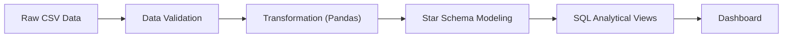

# 📊 Superstore ETL & Analytics Pipeline


A **production-style batch ETL pipeline** that transforms raw transactional data into analytics-ready datasets using validation, structured transformations, and dimensional modeling.

---

## 🧠 Design Goals

This project simulates a real-world **data engineering workflow**, focusing on:

* Data validation and anomaly detection
* Structured transformation and normalization
* Dimensional modeling (Star Schema)
* Data quality and reproducibility
* Analytics-ready data for BI systems

---

## 🚀 Tech Stack

* Python 3.12
* Pandas
* SQLite
* SQL (Analytical Queries)
* Structured Logging
* Power BI

---

## 📁 Project Structure

```text
superstore-etl-analytics/
├─ assets/                  # Dashboard images
├─ SQL/                     # Analytical queries / views
├─ clean_superstore.py      # Data cleaning logic
├─ Superstore.csv           # Raw dataset
├─ superstore_analytics.pbix
├─ README.md
```

> Note: `output/` directory is generated at runtime and excluded from version control.

---

## 🏗 Architecture Overview



---

## 🔄 Data Flow

### 1️⃣ Ingestion

* Load raw CSV dataset
* Perform schema inspection

### 2️⃣ Validation

* Null checks
* Type validation
* Logical constraints

### 3️⃣ Transformation

* Data cleaning & normalization
* Feature engineering
* Derived metrics

### 4️⃣ Modeling

* Fact table: sales transactions
* Dimension tables: customer, product, region

### 5️⃣ Analytics

* SQL-based views
* Pre-aggregated datasets for BI

---

## 📊 Dashboard Preview

### Overview Dashboard


### Discount vs Profit Analysis


> Insight: High discount does not always lead to higher profit.

---

## 📊 Output

Generated after pipeline execution:

* Cleaned datasets
* Fact & dimension tables
* Analytical SQL views

---

## 🚀 Run Pipeline

```bash
python clean_superstore.py
```

---

## 📊 Observability

* Structured logging
* Execution tracking

---

## 📐 Key Design Decisions

* Layered pipeline architecture
* Star schema for analytical performance
* Pandas for transformation
* SQL for analytics layer

---

## 🎯 Batch Processing Characteristics

* Deterministic execution
* Data quality-first design
* Reproducible pipeline

---

## 🔮 Future Improvements

* Airflow orchestration
* Cloud data warehouse (S3 + Redshift / BigQuery)
* Data quality monitoring
* API serving layer integration

---

## 🏁 Portfolio Context

```text
Batch ETL (this project)
      ↓
Analytics API
      ↓
Streaming Pipeline (Kafka)
      ↓
Orchestration (Airflow)
```
