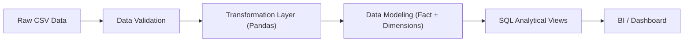

# 📊 Superstore ETL & Analytics Pipeline


A production-style batch data pipeline that transforms raw transactional data into analytics-ready datasets using validation, structured transformation, and dimensional modeling.

---

# 🧠 Design Goals

This project simulates a **production-style batch ETL pipeline** commonly used in modern analytics platforms.

Key objectives:

- Validate incoming raw data before processing
- Detect anomalies and logical inconsistencies
- Apply structured transformation logic
- Build a star schema for analytical workloads
- Ensure data quality and reproducibility
- Produce analytics-ready datasets for BI systems

---

# 🚀 Tech Stack

- Python 3.12
- Pandas
- SQLite
- SQL (Analytical Queries)
- Structured Logging
- CSV Data Sources
- Git

---

# 📂 Project Structure

```text
superstore-etl-analytics/
│
├── data/                  # Raw input data (CSV)
├── etl/                   # ETL logic (extract, transform, load)
├── models/                # Data modeling (fact & dimension tables)
├── sql/                   # Analytical queries / views
├── logs/                  # ETL execution logs
└── main.py                # Pipeline entrypoint
```

---

# 🏗 Architecture Overview



---

# 🔄 Data Flow

### 1️⃣ Raw Data Ingestion
- Load raw transactional dataset (CSV)
- Initial schema inspection

### 2️⃣ Data Validation
- Null checks
- Data type enforcement
- Logical consistency validation

### 3️⃣ Transformation Layer
- Data cleaning and normalization
- Feature engineering
- Derived metrics calculation

### 4️⃣ Data Modeling
Builds a **star schema**:
- Fact table: sales transactions
- Dimension tables: customer, product, region

### 5️⃣ Analytics Layer
- SQL-based analytical views
- Pre-aggregated datasets for BI queries

---

# 📊 Output

- Cleaned datasets
- Fact and dimension tables
- SQL views for reporting

---

# 🐍 Running the Pipeline

```bash
python main.py
```

---

# 📊 Observability

- Structured logging
- ETL execution logs

---

# 📐 Key Design Decisions

- Layered architecture (Validation → Transform → Model)
- Star schema for analytical performance
- Pandas for transformation
- SQL for analytics layer

---

# 🎯 Batch Processing Characteristics

- Deterministic processing
- Data quality first
- Layered pipeline design

---

# 🔮 Future Improvements

- Airflow orchestration
- PostgreSQL / Data Warehouse
- Data quality monitoring
- FastAPI integration

---

# 🏁 Portfolio Context

```text
Batch ETL (this project)
      ↓
Analytics API
      ↓
Streaming Pipeline
      ↓
Orchestration (Airflow)
```
