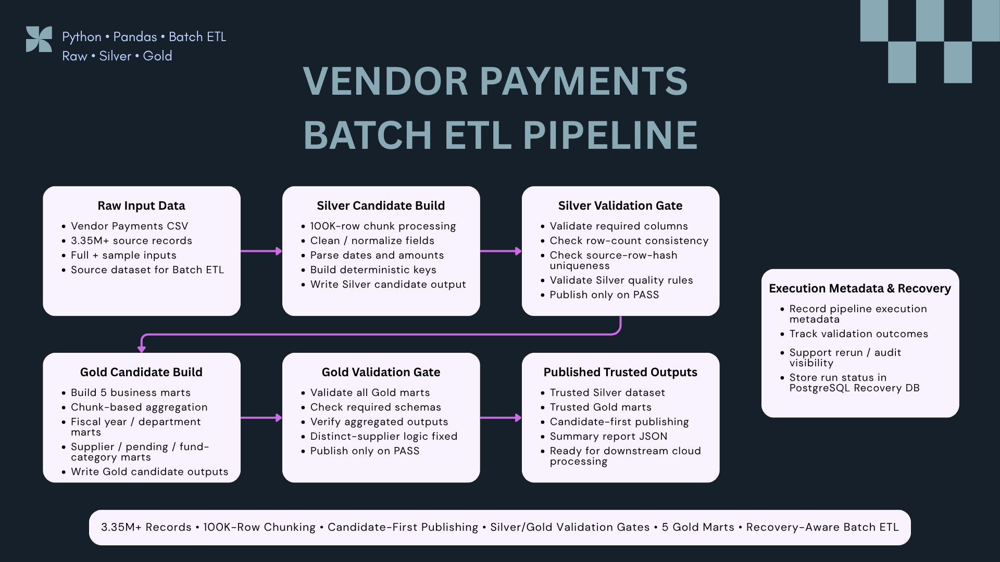
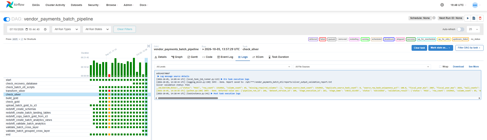
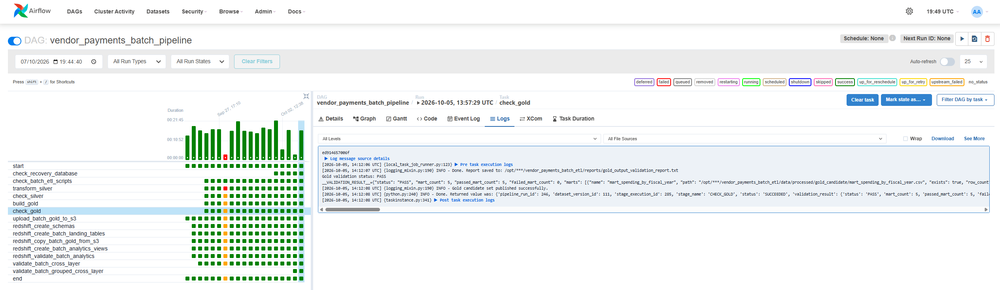
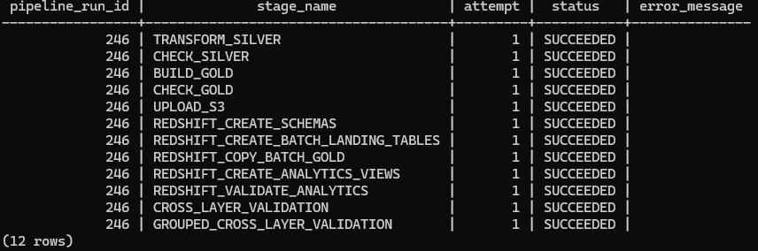
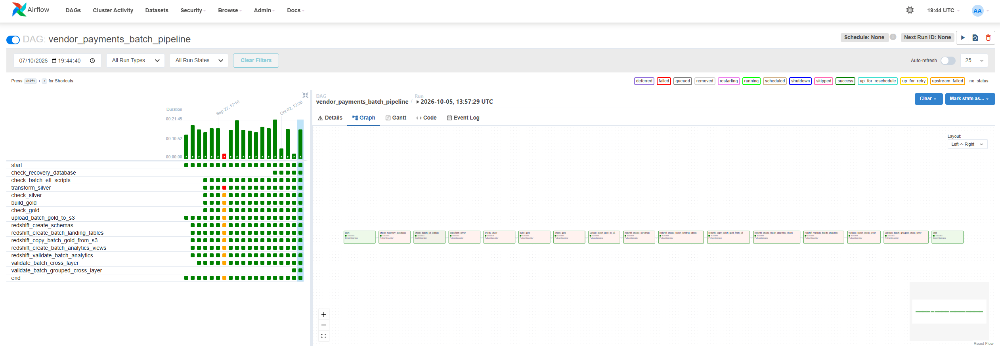
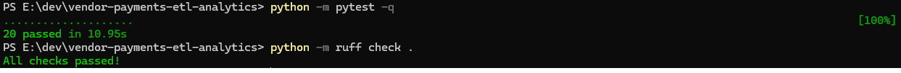
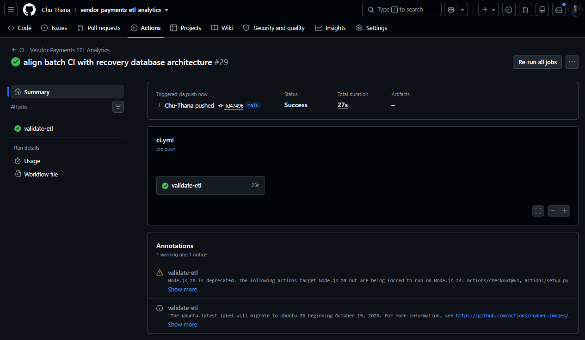

# 📊 Vendor Payments Batch ETL Pipeline


Production-style Batch ETL pipeline for transforming large-scale Vendor Payments data into validated Silver datasets and analytics-ready Gold marts.

This repository is the Batch transformation and data-quality layer of the Vendor Payments Data Platform. It owns the **Raw → Silver → Gold** lifecycle while integrating candidate-first publishing, validation gates, chunk-level recovery metadata, and downstream orchestration through Apache Airflow.

---

## 📌 Project Summary

The pipeline processes more than **3.35 million Vendor Payments records** through a recovery-aware Batch ETL workflow.

The current implementation demonstrates:

- 100,000-row chunk processing for large CSV datasets
- Raw → Silver → Gold layered processing
- Data cleaning, parsing, and normalization
- Deterministic row identity and business-level keys
- Explicit data-quality flags
- Candidate-first Silver publishing
- Candidate-first Gold publishing
- Silver and Gold hard validation gates
- Five analytics-ready Gold marts
- Chunk-level Recovery metadata in PostgreSQL
- Pipeline-stage execution metadata
- Full and sample execution modes
- Pytest, Ruff, and GitHub Actions validation
- Airflow integration for cloud publishing and downstream validation

The core processing boundary is:

```text
Raw Input
→ Silver Candidate Build
→ Silver Validation Gate
→ Gold Candidate Build
→ Gold Validation Gate
→ Trusted Silver / Gold Outputs
```

Recovery metadata is recorded alongside execution:

```text
Pipeline Run
→ Stage Execution
→ Chunk Registration
→ Chunk Attempt
→ Validation Result
```

---

## 🧭 Architecture



The final Batch design separates **transformation**, **validation**, **publication**, and **recovery state**.

```text
Raw Input Data
        ↓
Silver Candidate Build
        ↓
Silver Validation Gate
        ↓
Gold Candidate Build
        ↓
Gold Validation Gate
        ↓
Published Trusted Outputs
```

PostgreSQL Recovery metadata tracks execution state independently of the generated CSV artifacts.

### Layer Responsibilities

- **Raw Input Data** — Vendor Payments CSV containing more than 3.35M source records.
- **Silver Candidate Build** — Chunk-based cleaning, normalization, type parsing, deterministic keys, and quality flags.
- **Silver Validation Gate** — Required-column checks, row-count consistency, source-row-hash uniqueness, and Silver quality validation.
- **Gold Candidate Build** — Chunk-based aggregation into five business marts.
- **Gold Validation Gate** — Mart schema checks, output validation, and publication only after PASS.
- **Published Trusted Outputs** — Validated Silver and Gold datasets available for downstream Airflow and Cloud processing.
- **Execution Metadata & Recovery** — PostgreSQL-backed pipeline, stage, and chunk execution state for audit and rerun visibility.

---

## 📊 Validated Results

| Metric | Result |
| --- | ---: |
| Source records processed | 3,354,965 |
| Silver records validated | 3,354,965 |
| Processing chunks | 34 |
| Chunk size | 100,000 rows |
| Silver columns validated | 49 |
| Source row hash uniqueness | 100% |
| Gold marts produced | 5 |
| Gold marts passed validation | 5 / 5 |
| Automated tests | 20 passed |
| Ruff linting | PASS |
| Recovery-aware Batch stages | 12 succeeded |
| Pipeline status | Success |

---

## 📂 Dataset

The source dataset contains Vendor Payments and purchase-order records.

Representative fields include:

- Fiscal year
- Organization group and department
- Program and fund information
- Supplier / payee name
- Purchase-order reference
- Voucher paid and pending amounts
- Encumbrance balance
- Contract information
- Source freshness timestamps

The full source file remains local because of its size:

```text
data/raw/Vendor_Payments.csv
```

A representative sample is committed for tests and CI:

```text
data/sample/vendor_payments_sample.csv
```

---

## 🧪 Data Readiness and Transformation Rules

The Batch pipeline preserves suspicious records where possible and surfaces them through explicit flags rather than silently dropping them.

Representative checks and transformations include:

- Expected source schema validation
- Numeric cleaning
- Date and timestamp parsing
- Text trimming and normalization
- Contract-number normalization
- Deterministic row hashing
- Business composite keys
- Missing department checks
- Missing purchase-order date checks
- Negative payment flags
- Large payment thresholds
- Fiscal-year consistency checks

---

# 🥈 Silver Layer

## Chunk-Based Transformation

The full dataset is processed in:

```text
100,000-row chunks
```

This avoids loading the complete 3.35M+ row dataset into memory at once.

Each chunk is transformed independently and written to a chunk artifact before final Silver assembly.

Representative Silver fields include:

```text
source_row_hash
business_composite_key
fiscal_year
department
purchase_order
supplier_name
vouchers_paid
vouchers_pending
encumbrance_balance
data_as_of
data_loaded_at
po_year
po_month
```

Representative quality flags include:

```text
is_missing_department
is_missing_purchase_order_date
is_negative_paid
is_large_paid_1m
is_large_paid_10m
is_large_paid_100m
is_large_paid_1b
is_fiscal_year_mismatch
is_non_profit
```

---

## Candidate-First Silver Publishing

The Silver layer no longer publishes transformation output immediately.

```text
Transform
→ Silver candidate
→ Validate
→ Publish trusted Silver only on PASS
```

Candidate output:

```text
data/processed/silver/vendor_payments_silver.candidate.csv
```

Published trusted output:

```text
data/processed/silver/vendor_payments_silver.csv
```

This prevents a failed or partially produced transformation from replacing the last trusted Silver dataset.

---

## ✅ Silver Validation Gate

The latest full Silver validation confirms:

```text
Status: PASS
Rows checked: 3,354,965
Column count: 49
source_row_hash uniqueness: 100%
Fiscal year range: 2007–2026
```



The validation gate checks required columns, row-count consistency, deterministic row identity, and required data-quality conditions before publication.

---

# 🥇 Gold Layer

## Gold Candidate Build

The Gold layer produces five analytics-ready business marts:

| Mart | Purpose |
| --- | --- |
| `mart_spending_by_fiscal_year` | Fiscal-year spending trends |
| `mart_spending_by_department` | Department-level spending analytics |
| `mart_spending_by_supplier_top_n` | Top supplier analysis |
| `mart_pending_by_department` | Pending voucher monitoring |
| `mart_fund_category_summary` | Fund-category analytics |

Gold processing uses chunk-based partial aggregation followed by final aggregation.

The supplier distinct-count logic is calculated across the complete dataset rather than summing per-chunk distinct counts.

---

## Candidate-First Gold Publishing

Gold output follows the same trusted-publication boundary as Silver.

```text
Build Gold candidates
→ Validate all marts
→ Publish complete Gold set only on PASS
```

Candidate directory:

```text
data/processed/gold_candidate/
```

Published directory:

```text
data/processed/gold/
```

This avoids publishing a partially updated Gold layer when one mart fails validation.

---

## ✅ Gold Validation Gate

The latest full Gold validation confirms:

```text
Overall status: PASS
Mart count: 5
Passed mart count: 5
Failed mart count: 0
```



The five marts are validated as a complete set before trusted publication.

---

# 🔁 Recovery-Aware Chunk Processing

The Batch pipeline integrates with the PostgreSQL Recovery Database.

Each Silver and Gold chunk can be associated with persistent execution metadata such as:

```text
dataset_version_id
chunk_id
chunk_index
source_start_row
source_end_row
status
row_count
checksum
attempt
```

This allows the pipeline to distinguish between:

```text
CREATED
PROCESSING
VALIDATED
FAILED
```

and supports recovery behavior such as:

- Reusing validated chunk artifacts when metadata still matches
- Reprocessing a chunk when file metadata no longer matches
- Recovering stale running attempts
- Recording successful and failed chunk attempts
- Enforcing a chunk-completeness gate before final assembly

A valid dataset version is supplied through:

```text
RECOVERY_DATASET_VERSION_ID
```

for recovery-aware production execution.

---

## 🧾 Batch Recovery Metadata

The latest verified Batch run records all major stages as successful:

```text
TRANSFORM_SILVER
CHECK_SILVER
BUILD_GOLD
CHECK_GOLD
UPLOAD_S3
REDSHIFT_CREATE_SCHEMAS
REDSHIFT_CREATE_BATCH_LANDING_TABLES
REDSHIFT_COPY_BATCH_GOLD
REDSHIFT_CREATE_ANALYTICS_VIEWS
REDSHIFT_VALIDATE_ANALYTICS
CROSS_LAYER_VALIDATION
GROUPED_CROSS_LAYER_VALIDATION
```



This provides persistent execution history beyond Airflow task color or local console logs.

---

# 🖥️ Full Batch Execution

In the integrated platform, the final full Batch execution is orchestrated through the dedicated Airflow Batch DAG.

```text
check_recovery_database
→ check_batch_etl_scripts
→ transform_silver
→ check_silver
→ build_gold
→ check_gold
→ upload_batch_gold_to_s3
→ Redshift processing
→ cross-layer validation
→ grouped cross-layer validation
```



The final DAG run completed successfully across the complete Batch lifecycle.

---

# 🔎 Downstream Cross-Layer Validation

The Batch repository owns Raw → Silver → Gold transformation and local validation.

Downstream cloud reconciliation is orchestrated through Airflow using the Cloud Data Platform repository.

Validation includes:

```text
S3 / Athena metrics
↔
Redshift metrics
```

Summary reconciliation compares metrics such as:

```text
row_count
source_record_count
total_vouchers_paid
total_vouchers_pending
total_encumbrance_balance
```

Grouped reconciliation additionally validates:

```text
fiscal_year
department
fund_category
```

This keeps transformation ownership in the Batch repository while preserving independent data-lake-to-warehouse validation downstream.

---

# 🧪 Automated Testing and Code Quality

Run:

```powershell
python -m pytest -q
python -m ruff check .
```

Latest verified result:

```text
20 passed
All checks passed!
```



The test suite covers transformation utilities, schema definitions, deterministic keys, sample execution, Silver/Gold output generation, and recovery-aware Batch execution contracts.

Recovery DB calls are mocked in sample tests so CI can validate Batch logic without requiring a live PostgreSQL Recovery instance.

---

# ⚙️ Continuous Integration

GitHub Actions validates the repository on configured pushes and pull requests.

The CI flow uses the committed representative sample rather than requiring the full local source dataset.

```text
Repository checkout
→ Python setup
→ Dependency installation
→ Ruff validation
→ Sample ETL tests
→ Pytest validation
```

Final CI evidence will be captured after the final multi-repository push.



---

# 📸 Final Execution Evidence

```text
00_batch_etl_architecture.png
01_full_batch_execution.png
02_silver_output_validation.png
03_gold_output_validation.png
04_batch_tests_and_lint.png
05_batch_ci_success.png
06_batch_recovery_metadata.png
```

The evidence set covers architecture, full Batch orchestration, Silver and Gold validation, automated testing and linting, CI, and persistent Recovery metadata.

---

# 🗂️ Project Structure

```text
vendor-payments-etl-analytics/
│
├── assets/
│   ├── 00_batch_etl_architecture.png
│   ├── 01_full_batch_execution.png
│   ├── 02_silver_output_validation.png
│   ├── 03_gold_output_validation.png
│   ├── 04_batch_tests_and_lint.png
│   ├── 05_batch_ci_success.png
│   └── 06_batch_recovery_metadata.png
│
├── data/
│   ├── raw/
│   ├── sample/
│   └── processed/
│       ├── silver/
│       ├── gold_candidate/
│       ├── gold_partial/
│       └── gold/
│
├── reports/
├── scripts/
│   ├── checks/
│   └── pipeline/
│       ├── transform_silver.py
│       ├── build_gold_marts.py
│       └── run_pipeline.py
│
├── src/
│   ├── cleaning.py
│   ├── config.py
│   ├── keys.py
│   ├── recovery.py
│   └── schema.py
│
├── tests/
│   ├── conftest.py
│   ├── test_cleaning.py
│   ├── test_keys.py
│   ├── test_pipeline_metadata.py
│   ├── test_sample_pipeline.py
│   ├── test_schema.py
│   └── test_stream_sample.py
│
├── .github/
│   └── workflows/
│       └── ci.yml
│
├── pyproject.toml
├── pytest.ini
├── requirements.txt
└── README.md
```

---

# ▶️ Run Locally

## 1. Create and activate a virtual environment

```powershell
python -m venv .venv
.\.venv\Scripts\Activate.ps1
```

## 2. Install dependencies

```powershell
python -m pip install --upgrade pip
python -m pip install -r requirements.txt
```

## 3. Run tests

```powershell
python -m pytest -q
```

## 4. Run Ruff

```powershell
python -m ruff check .
```

---

## Recovery-Aware Full Execution

The final full Batch path requires a valid Recovery dataset version.

In the integrated platform, Apache Airflow creates and supplies the required Recovery context before executing Batch stages.

Recommended full-platform execution:

```text
Airflow Batch DAG
→ Recovery context
→ Silver candidate build
→ Silver validation
→ Gold candidate build
→ Gold validation
→ Cloud processing
```

A direct recovery-aware execution requires a valid:

```text
RECOVERY_DATASET_VERSION_ID
```

from the PostgreSQL Recovery Database.

Do not use an arbitrary dataset version ID because chunk metadata is protected by database referential-integrity constraints.

---

## Sample / Test Execution

The committed sample dataset supports reproducible automated validation without requiring the full source dataset or a live Recovery Database.

```powershell
python -m pytest -q
```

Recovery integration is mocked in the relevant sample tests while preserving the production requirement for real Recovery metadata.

---

# ☁️ Airflow Integration

The Batch ETL repository remains the owner of Raw → Silver → Gold transformation logic.

The dedicated Airflow Batch DAG owns execution ordering and downstream orchestration:

```text
check_recovery_database
→ check_batch_etl_scripts
→ transform_silver
→ check_silver
→ build_gold
→ check_gold
→ upload_batch_gold_to_s3
→ redshift_create_schemas
→ redshift_create_batch_landing_tables
→ redshift_copy_batch_gold_from_s3
→ redshift_create_batch_analytics_views
→ redshift_validate_batch_analytics
→ validate_batch_cross_layer
→ validate_batch_grouped_cross_layer
```

Responsibility remains separated:

```text
vendor-payments-etl-analytics
→ Raw → Silver → Gold transformation
→ candidate-first publication
→ local Silver / Gold validation
→ chunk recovery integration

vendor-payments-airflow-orchestration
→ execution order
→ Recovery stage coordination
→ cloud publishing
→ warehouse loading
→ downstream validation
```

---

# 🔗 Role in the Vendor Payments Data Platform

```text
Vendor Payments Raw Data
        ↓
Batch ETL
        ↓
Silver Candidate
        ↓
Silver Validation Gate
        ↓
Trusted Silver
        ↓
Gold Candidate Marts
        ↓
Gold Validation Gate
        ↓
Trusted Gold Marts
        ↓
Airflow Batch DAG
        ↓
Amazon S3
        ↓
Athena / Redshift
        ↓
Cross-Layer Validation
        ↓
API / Analytics
```

The trusted Silver dataset is also used as the source for deterministic bounded Streaming-window preparation, while Batch and Streaming retain separate processing lifecycles.

---

# 🧠 Key Engineering Decisions

## Why use chunk-based processing?

The full source contains more than 3.35 million records.

Processing in 100,000-row chunks reduces peak memory pressure and avoids requiring the complete dataset to be loaded at once.

---

## Why keep Raw, Silver, and Gold separate?

```text
Raw
→ preserve source data

Silver
→ clean, normalize, validate, and retain row-level traceability

Gold
→ produce analytics-ready business aggregates
```

---

## Why use candidate-first publishing?

A successful transformation does not prove that the resulting dataset is valid.

```text
candidate
→ validation
→ trusted publish
```

Silver and Gold outputs replace trusted published data only after their validation gate passes.

---

## Why separate transform and validation gates?

Keeping transformation and validation as separate execution boundaries makes failures explicit.

```text
TRANSFORM_SILVER
→ CHECK_SILVER
→ BUILD_GOLD
→ CHECK_GOLD
```

A downstream stage cannot continue when its upstream validation gate fails.

---

## Why use `source_row_hash`?

The source does not provide a reliable single-column primary key.

`source_row_hash` provides deterministic row-level identity and supports row-preservation and duplicate validation.

---

## Why use a business composite key?

Purchase-order values are not globally unique, and many rows represent direct payments.

A business composite key supports business-level duplicate analysis without incorrectly treating purchase order as a universal primary key.

---

## Why preserve negative and large payments?

These values may represent adjustments, reversals, corrections, or legitimate high-value transactions.

The pipeline flags them rather than deleting them automatically.

---

## Why use PostgreSQL Recovery metadata?

Airflow task state alone is not enough to represent data-processing progress inside a multi-chunk ETL operation.

The Recovery Database persists:

```text
pipeline run
stage
dataset version
chunk
attempt
status
row count
checksum
validation result
```

This supports auditability, stale-attempt recovery, chunk-level reruns, and trusted resume behavior.

---

## Why validate chunk checksums and row counts?

A chunk marked `VALIDATED` should only be reused when the corresponding file still matches its recorded metadata.

If the file no longer matches, the chunk is invalidated and reprocessed rather than silently reused.

---

## Why use sample mode and mocked Recovery integration in tests?

The full source dataset is too large to commit, and CI should not require a live PostgreSQL service just to validate Batch transformation logic.

The committed sample provides a reproducible test path while the Recovery integration contract is mocked at the external dependency boundary.

---

# 🛣️ Planned Improvements

Possible production-oriented extensions include:

- Incremental or partition-aware Batch ingestion
- Configurable data-quality thresholds
- Centralized observability and alerting
- Cloud-backed source ingestion
- Additional performance and memory profiling
- Production-grade retention policies for Recovery metadata
- Automated alerting for failed validation gates

---

# 🎯 Key Takeaway

The Batch ETL pipeline now combines large-scale chunk processing with explicit publication and recovery boundaries:

```text
3.35M+ Raw Records
→ 34 Processing Chunks
→ Silver Candidate
→ Silver Validation Gate
→ Trusted Silver
→ 5 Gold Candidate Marts
→ Gold Validation Gate
→ Trusted Gold
→ PostgreSQL Recovery Metadata
→ Airflow / AWS / API / Analytics
```

The result is a reproducible, recovery-aware Batch foundation with clear data-layer ownership, row-level traceability, candidate-first publication, validation gates, analytics-ready outputs, automated testing, and measurable downstream integration.
